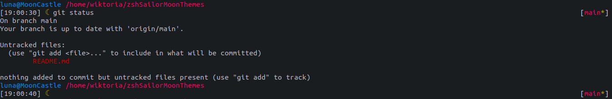
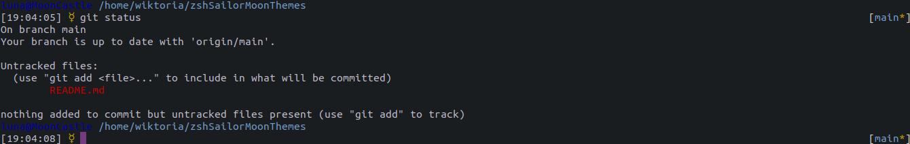
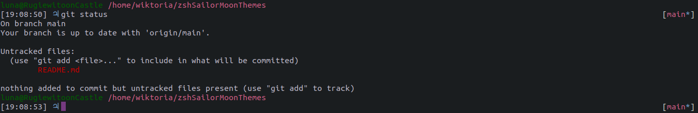
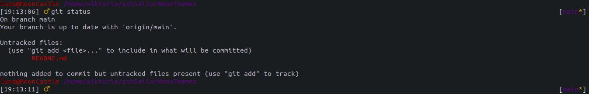
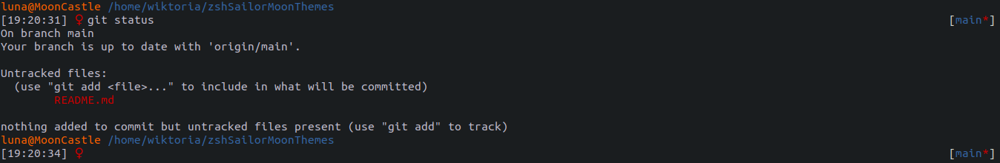
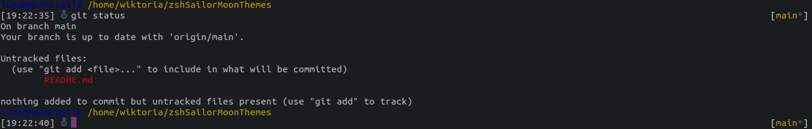
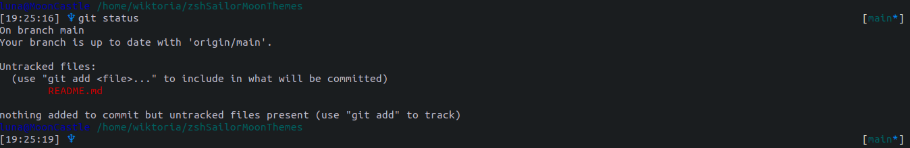
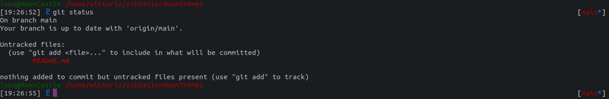
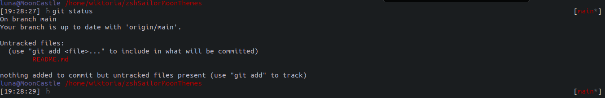

# Sailor Moon Themes for zsh

## Themes
### Sailor Moon

### Sailor Mercury

### Sailor Jupiter

### Sailor Mars

### Sailor Venus

### Sailor Uranus

### Sailor Neptune

### Sailor Pluto

### Sailor Saturn


## Installation
### Using antigen
```commandline
antigen theme Domanowska/zshSailorMoonThemes@main themes/sailormoon
```
### Using zgenom
```commandline
zgenom load Domanowska/zshSailorMoonThemes themes/sailormercury
```
### Manual
*Note: Following the steps below risks losing all your zsh settings, make sure to have a backup!*
1. Copy files into your `/.oh-my-zsh/themes/` folder
2. Edit `.zshrc` and change `ZSH_THEME="robbyrussell"` to `ZSH_THEME="sailorjupiter"`
3. Run `source .zshrc` to see changes
